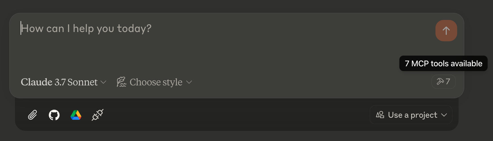
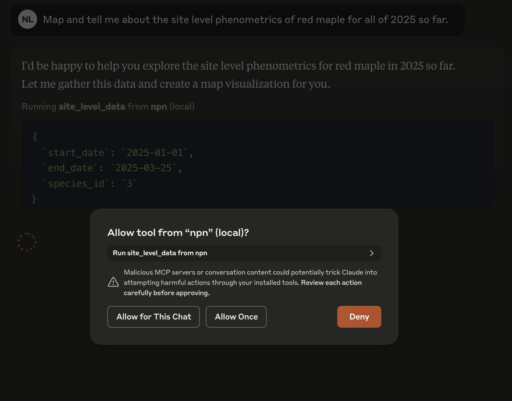

# National Phenology Network MCP Server

----------------------------------------------------------------------------------------

[](https://github.com/VectorInstitute/usa-npn-mcp-server/actions/workflows/code_checks.yml)
[](https://github.com/VectorInstitute/usa-npn-mcp-server/actions/workflows/integration_tests.yml)
[](https://github.com/VectorInstitute/usa-npn-mcp-server/actions/workflows/docs_deploy.yml)


### Available MCP Tools

- `status-intensity` - Fetches status and intensity data (raw observation data).
- `individual-phenometrics` - Fetches individual phenometrics (summarized data).
- `site-phenometrics` - Fetches site phenometrics (site-level data).
- `magnitude-phenometrics` - Fetches magnitude phenometrics (magnitude data).
- `observation-comment` - Fetches observation comments based on observation_id.
- `mapping` - Maps site phenometrics onto a map of the USA with optional colour labelling.
- `check-reference-material` - Checks database containing NPN API reference material using a generated sql query.

### Available MCP Prompts

- `map_data` - Structured workflow for working interactively with user to query site phenometrics and map the results, initialized with start-date and end-date.

#


## 🧑🏿‍💻 Developing

### Prerequisites

`uv` will manage the virtual environment and dependencies for you.

#

Install `uv` for your operating system:

<details>
<summary>macOS and Linux</summary>

```bash
curl -LsSf https://astral.sh/uv/install.sh | sh
```

</details>

<details>
<summary>Windows</summary>

In powershell, run:

```powershell
# Install uv
powershell -ExecutionPolicy ByPass -c "irm https://astral.sh/uv/install.ps1 | iex"
```

</details>

#

### Clone the repository

Using HTTPS (recommended for most users):
   ```bash
   git clone https://github.com/VectorInstitute/usa-npn-mcp-server.git
   ```

Using SSH (if you have SSH keys configured with GitHub):
   ```bash
   git clone git@github.com:VectorInstitute/usa-npn-mcp-server.git
   ```

After cloning with either method:
  ```bash
  cd usa-npn-mcp-server
  ```

### Installing dependencies

#

After `uv` is installed, run:

<details>
<summary>macOS and Linux</summary>

  ```bash
  uv sync
  source .venv/bin/activate
  ```

</details>

<details>
<summary>Windows</summary>

  In powershell, run:

  ```powershell
  uv sync
  . .\.venv\Scripts\activate.ps1
  ```

  If the last command returns an error about running scripts being disabled on the system, you can run the following command in PowerShell to allow script execution for the current user:

  ```powershell
  Set-ExecutionPolicy RemoteSigned -Scope CurrentUser
  ```

  Then run the activation command again:

  ```powershell
  . .\.venv\Scripts\activate.ps1
  ```

</details>

#

These commands set up and activate the `.venv` environment as specified in the `pyproject.toml` and `uv.lock` files.

## Configuration

### Configure for Claude Desktop App

You can download the Claude Desktop Application from [here](https://claude.ai/download).

Once installed, you will need to modify your `claude_desktop_config.json` to make it aware of the MCP Server.

#

How to find and modify claude_desktop_config.json:

<details>
<summary>macOS and Linux</summary>

1. Open Claude Desktop app
2. Click on "Claude" in the menu bar and select "Settings" - you may need to enable "Developer Mode" to proceed
3. In the Settings window, click on the "Developer" tab in the left sidebar
4. Click the "Edit Config" button
5. This will open a Finder window showing the location of the `claude_desktop_config.json` file
6. Open the file with your preferred text editor

<details>
<summary>Add to claude config file:</summary>

```json
{
  "mcpServers": {
    "npn": {
      "command": "bash",
      "args": [
        "-c",
        "source /absolute/path/to/usa-npn-mcp-server/.venv/bin/activate && uv run usa_npn_mcp_server"
      ]
    }
  }
}
```

  **NOTE**: Replace "/absolute/path/to/usa-npn-mcp-server/" with local path to repo dir

</details>
</details>

<details>
<summary>Windows</summary>

1. Open Claude Desktop app
2. CTRL+Comma or Open the menu bar (three bar symbol top-left) and select "File" and "Settings" - you may need to enable "Developer Mode" to proceed
3. In the Settings window, click on the "Developer" tab in the left sidebar
4. Click the "Edit Config" button
5. This will open a window showing the location of the `claude_desktop_config.json` file
6. Open the file with your preferred text editor.

<details>
<summary>Add to claude config file:</summary>

```json
{
  "mcpServers": {
  "npn": {
    "command": "cmd.exe",
    "args": [
      "/c",
      "C:\\absolute\\path\\to\\usa-npn-mcp-server\\.venv\\Scripts\\activate.bat && uv run usa_npn_mcp_server"
      ]
    }
  }
}
```

  **NOTE**: Replace "C:\\absolute\\path\\to\\usa-npn-mcp-server\\" with local absolute path to repo dir and be sure to use forward backslashes

</details>

</details>

#

After saving the changes, restart Claude Desktop. You should see a new :electric_plug: icon and/or :hammer: icons in your chat prompt that confirms the MCP Server is detected.



Each time you create a new chat that uses a Tool from the MCP Server, you will have to agree to permit access to the MCP Server's Tool.



## Debugging

**Debugging with MCP Inspector (Currently only macOS and Linux)**: To run a locally hosted MCP interpreter for debugging, use:

   ```bash
   npx @modelcontextprotocol/inspector uv run usa_npn_mcp_server
   ```

The first time you run this command you'll be prompted to download `@modelcontextprotocol/inspector`.

This command starts the MCP inspector within the `uv`-managed environment. The inspector can be used locally in-browser to inspect/test the server.

**Testing dependencies**: To install dependencies for testing (codestyle, unit tests, integration tests), run:

```bash
uv sync --dev
```

## Other MCP Servers

For examples of other MCP servers and implementation patterns, see:
https://github.com/modelcontextprotocol/servers
