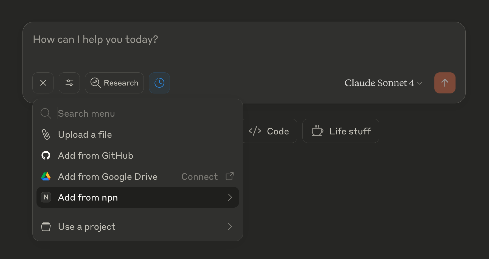
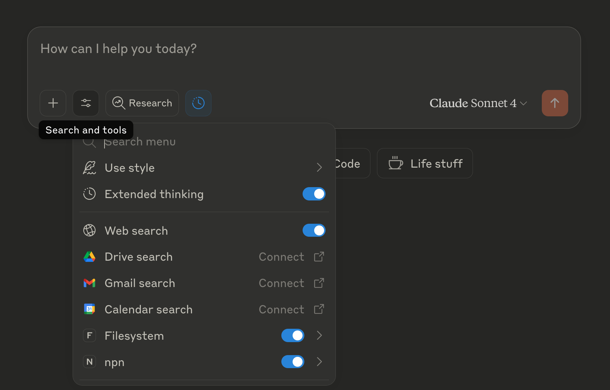
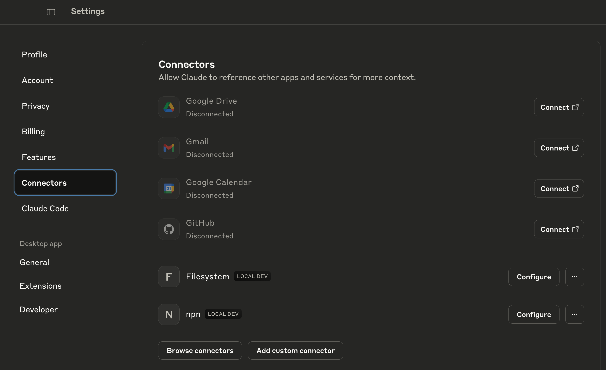
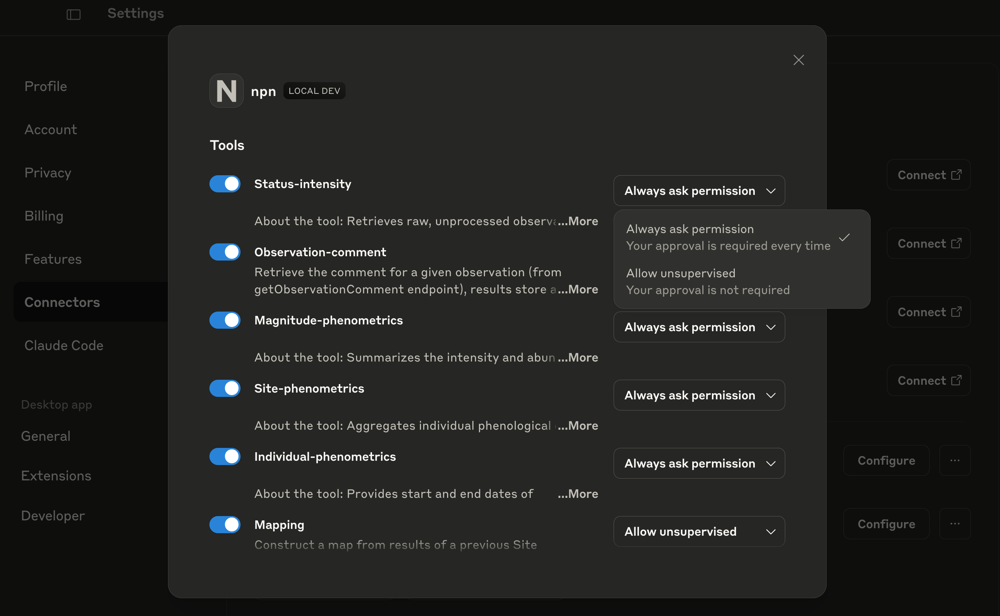
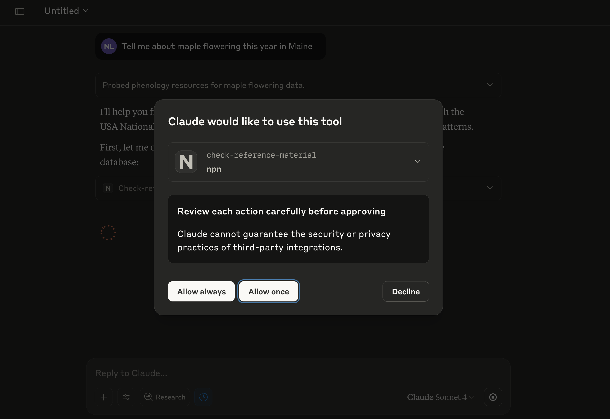

# National Phenology Network MCP Server

----------------------------------------------------------------------------------------

[](https://github.com/VectorInstitute/usa-npn-mcp-server/actions/workflows/code_checks.yml)
[](https://github.com/VectorInstitute/usa-npn-mcp-server/actions/workflows/unit_tests.yml)
[](https://github.com/VectorInstitute/usa-npn-mcp-server/actions/workflows/integration_tests.yml)
[](https://github.com/VectorInstitute/usa-npn-mcp-server/actions/workflows/docs_deploy.yml)

[](https://github.com/VectorInstitute/usa-npn-mcp-server/blob/main/LICENSE)

#


### Available MCP Tools

- `status-intensity` - Fetches status and intensity data (raw observation data).
- `individual-phenometrics` - Fetches individual phenometrics (summarized data).
- `site-phenometrics` - Fetches site phenometrics (site-level data).
- `magnitude-phenometrics` - Fetches magnitude phenometrics (magnitude data).
- `observation-comment` - Fetches observation comments based on observation_id.
- `mapping` - Maps site phenometrics onto a map of the USA with optional color labeling.
- `check-reference-material` - Checks database containing NPN API reference material using a generated sql query.
- `check-literature` - Queries database of structured summaries from 175 papers that use phenology and phenometrics data.
- `export-raw-data` - Exports raw data to JSON or JSONL files in allowed directories.
- `get-raw-data` - Fetches raw data instead of summaries as from other tools.

### Available MCP Resources

- `recent-queries` - List of recent query hash IDs and metadata for cached data access.
- `available-roots` - List of available root directories for file export operations.

### Available MCP Prompts

- `map_data` - Structured workflow for working interactively with user to query site phenometrics and map the results, initialized with start-date and end-date.


## 🧑🏿‍💻 Developing

### Prerequisites

`uv` will manage the virtual environment and dependencies for you.

#

Install `uv` for your operating system:

<details>
<summary>macOS and Linux</summary>

```bash
curl -LsSf https://astral.sh/uv/install.sh | sh
```

</details>

<details>
<summary>Windows</summary>

In powershell, run:

```powershell
# Install uv
powershell -ExecutionPolicy ByPass -c "irm https://astral.sh/uv/install.ps1 | iex"
```

</details>

#

### Clone the repository

Using HTTPS (recommended for most users):
   ```bash
   git clone https://github.com/VectorInstitute/usa-npn-mcp-server.git
   ```

Using SSH (if you have SSH keys configured with GitHub):
   ```bash
   git clone git@github.com:VectorInstitute/usa-npn-mcp-server.git
   ```

After cloning with either method:
  ```bash
  cd usa-npn-mcp-server
  ```

### Installing dependencies

#

After `uv` is installed, run:

<details>
<summary>macOS and Linux</summary>

  ```bash
  uv sync
  source .venv/bin/activate
  ```

</details>

<details>
<summary>Windows</summary>

  In powershell, run:

  ```powershell
  uv sync
  . .\.venv\Scripts\activate.ps1
  ```

  If the last command returns an error about running scripts being disabled on the system, you can run the following command in PowerShell to allow script execution for the current user:

  ```powershell
  Set-ExecutionPolicy RemoteSigned -Scope CurrentUser
  ```

  Then run the activation command again:

  ```powershell
  . .\.venv\Scripts\activate.ps1
  ```

</details>

#

These commands set up and activate the `.venv` environment as specified in the `pyproject.toml` and `uv.lock` files.

## Configuration

### Configure for Claude Desktop App

You can download the Claude Desktop Application from [here](https://claude.ai/download).

Once installed, you will need to modify your `claude_desktop_config.json` to make it aware of the MCP Server.

#

How to find and modify claude_desktop_config.json:

<details>
<summary>macOS and Linux</summary>

1. Open Claude Desktop app
2. Click on "Claude" in the menu bar and select "Settings"
3. In the Settings window, click on the "Developer" tab in the left sidebar
4. Click the "Edit Config" button
5. This will open a Finder window showing the location of the `claude_desktop_config.json` file
6. Open the file with your preferred text editor

<details>
<summary>Add to claude config file:</summary>

```json
{
  "mcpServers": {
    "npn": {
      "command": "bash",
      "args": [
        "-c",
        "source /absolute/path/to/usa-npn-mcp-server/.venv/bin/activate && uv run usa_npn_mcp_server /absolute/path/to/export/directory"
      ]
    }
  }
}
```

  **NOTE**: Replace `/absolute/path/to/usa-npn-mcp-server/` with local path to repo dir and `/absolute/path/to/export/directory` with local path to directory where you want exported files to be saved (or exclude this part to disable file export). You can specify multiple directories separated by spaces.

</details>
</details>

<details>
<summary>Windows</summary>

1. Open Claude Desktop app
2. CTRL+Comma or Open the menu bar (three bar symbol top-left) and select "File" and "Settings"
3. In the Settings window, click on the "Developer" tab in the left sidebar
4. Click the "Edit Config" button
5. This will open a window showing the location of the `claude_desktop_config.json` file
6. Open the file with your preferred text editor.

<details>
<summary>Add to claude config file:</summary>

```json
{
  "mcpServers": {
  "npn": {
    "command": "cmd.exe",
    "args": [
      "/c",
      "C:\\absolute\\path\\to\\usa-npn-mcp-server\\.venv\\Scripts\\activate.bat && uv run usa_npn_mcp_server 'C:\\absolute\\path\\to\\export\\directory'"
      ]
    }
  }
}
```

  **NOTE**: Replace `C:\\absolute\\path\\to\\usa-npn-mcp-server\\` with local path to repo dir and `'C:\\absolute\\path\\to\\export\\directory'` (including the single quotes) with local path to directory where you want exported files to be saved (or exclude this part to disable file export). You can specify multiple directories separated by spaces - be sure to use backslashes for Windows paths.

</details>

</details>

#

After saving the changes, restart Claude Desktop. If you receive no error messages from the Claude UI, the USA-NPN MCP server is likely installed correctly. Clicking the two buttons in the bottom left of the new chat box should reveal new options with `npn` labeling.




You should see a new local MCP server in the "Connectors" section of the Settings as below. This example has Filesystem and npn (usa-npn-mcp-server) MCP Servers enabled.



To enable tool use, you can click "Configure" (seen in the image above) and adjust which tools are enabled using the blue sliders and the permissions for each tool.



If you do not configure permissions this way, the tools will be enabled by default and permissions will be set to "Always ask permission" and each tool use will ask with an in-chat pop-up as below.




### Recommended Complementary MCP Servers

Additional MCP Servers can be added to Claude Desktop in `Settings` using the `Extensions` tab by clicking `Browse extensions`. For use together with the USA-NPN MCP Server, the two following MCP Servers are recommended:

#### 1. **Filesystem**:
- Let Claude access specified directories in your filesystem to read and write files.
- Configure `filesystem` with matching allowed directories as `usa-npn-mcp-server` for making data available during data analysis - both from recent queries saved to file and for externally sourced data files.

**Note**:  A more fully featured alternative is [Desktop Commander](https://desktopcommander.app/) but it is not available in the listed extensions and would need to be configured by clicking `add a custom one` and performing [custom installation and configuration](https://desktopcommander.app/#installation). However, adding advanced or too many different MCP Servers to Claude can bloat your context window with tool descriptions. If you are experiencing context limitations, consider disabling some or all additional MCP Servers.

#### 2. **Context7**:
- Let Claude access up-to-date code documentation for data analysis.


## File Export Configuration

The server supports exporting data to files within specified directories. You can configure allowed export directories in two ways:

#### Command-line Arguments (Recommended)
Pass directory paths as arguments when starting the server:
```bash
# Single directory
uv run usa_npn_mcp_server /path/to/exports

# Multiple directories
uv run usa_npn_mcp_server /path/to/exports /path/to/another/dir
```

#### Environment Variable
Set the `NPN_MCP_ALLOWED_DIRS` environment variable:
```bash
# Unix/macOS (colon-separated)
export NPN_MCP_ALLOWED_DIRS="/path/to/exports:/path/to/another/dir"

# Windows (semicolon-separated)
set NPN_MCP_ALLOWED_DIRS="C:\path\to\exports;D:\another\dir"
```

**Security Note**: The server will only allow file operations within the specified directories for security.

## Debugging

**Debugging with MCP Inspector (Currently only macOS and Linux)**: To run a locally hosted MCP interpreter for debugging, use:

   ```bash
   # Without file export
   npx @modelcontextprotocol/inspector uv run usa_npn_mcp_server

   # With file export to a specific directory
   npx @modelcontextprotocol/inspector uv run usa_npn_mcp_server /path/to/exports
   ```

The first time you run this command you'll be prompted to download `@modelcontextprotocol/inspector`.

This command starts the MCP inspector within the `uv`-managed environment. The inspector can be used locally in-browser to inspect/test the server.

**Testing dependencies**: To install dependencies for testing (codestyle, unit tests, integration tests), run:

```bash
uv sync --dev
```

## Other MCP Servers

For examples of other MCP servers and implementation patterns, see:
https://github.com/modelcontextprotocol/servers
