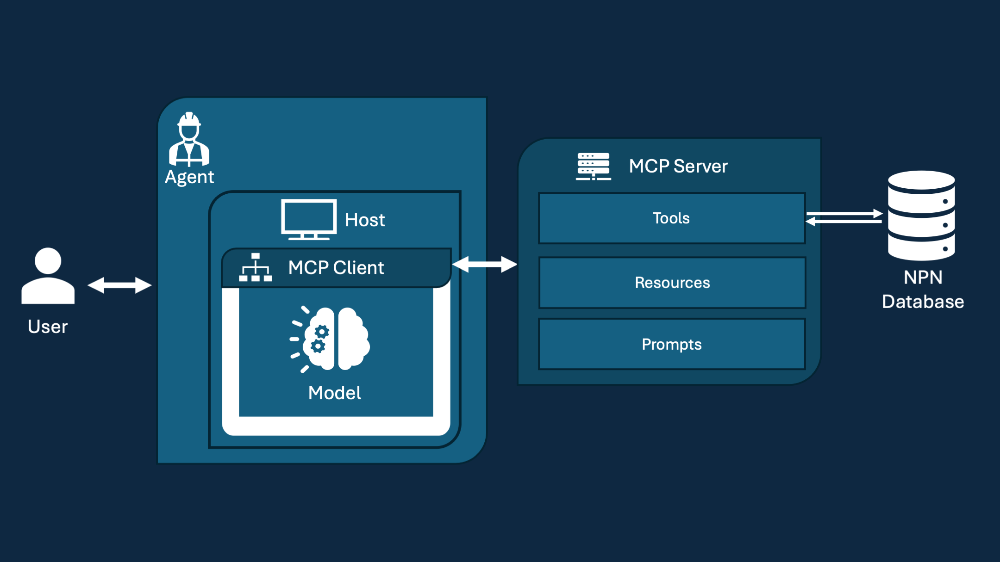

# User Guide

These tools enable natural language querying and analysis through AI Agents, streamlining access to and interpretation of phenological information collected by the USA-NPN.

You can get started quickly by following the [Getting Started](#getting-started) below.

More detail about the Agent, Client and MCP Server's architecture are also [provided below](#agentic-systems-and-mcp-servers) as well as [examples](#examples) of using the MCP Server to access and analyze phenological data.

## Getting Started

### Prerequisites
Host: Recommended is [Claude Desktop App](https://claude.ai/download) but any AI Agent (IDE, AI Tool etc) that supports the Model Context Protocol (MCP) can be used as a Host.

1. **Install MCP Server**: The GitHub repository [README.md](../../README.md) contains instructions for installing the MCP Server and configuration with Claude Desktop App.

## What is USA-NPN MCP Server?

Large Language Models (LLMs) have proven powerful in reasoning and generalize well across tasks. AI Agents result from connecting powerful models to tools, allowing them to interact with the world. Adding to the Agent's toolkit is a major goal of this project.

Recently, interaction between AI Agents and their underlying tools was pushed towards standardization and cross-model compatibility with the **Model Context Protocol (MCP)**, a structured Client-Server communication protocol.

The custom MCP Server presented here can communicate with MCP Clients in MCP-compatible Hosts (like Claude Desktop, IDEs or AI Tools) to add USA-NPN Data interaction and analysis to the Agent's repertoire.

There are [many other awesome MCP Servers](https://github.com/appcypher/awesome-mcp-servers) for making capable AI Agents.

### Agentic Systems and Model Content Protocol (MCP)

| Symbol | Term          | Description                                                                                                                                                                                                |
|--------|---------------|------------------------------------------------------------------------------------------------------------------------------------------------------------------------------------------------------------|
|  | **LLM**       | A Large Language Model, such as Claude Sonnet 3.7 or GPT-4o, that can "understand" and generate text. These models are often pre-trained to perform well on a diversity of tasks. A model serves as the core AI "brain" for reasoning, natural language processing, and conversation. |
|  | **Host**      | An overarching application client that users interact with — such as a chat assistant (e.g., Claude Desktop) or an IDE-integrated tool. It manages workflows and connects to MCP Servers using MCP Clients. These often come with custom tooling like chatting or resource-attach integration. |
|  | **MCP Client**| Embedded within the Host, the MCP Client establishes and maintains a connection with MCP Servers through the Model Context Protocol (MCP), translating tool requests into protocol messages and managing stateful connections. |
|  | **MCP Server**| A lightweight server that runs locally and exposes specific capabilities to the MCP Client through MCP. The USA-NPN MCP Server described here provides Tools, Resources, and Prompts for orchestrating tasks like NPN API calls, data visualization, and phenology workflows. |
|  | **Agent**     | An entity empowered with an LLM for reasoning, decision-making, and language processing that is capable of tool use and orchestration (deciding when to use a tool). It performs tasks using connected tools and resources, managing multi-step interactions and complex workflows. |

### Using these terms:

The Claude AI **Agent** is empowered with the **LLM** Claude Sonnet 3.7 and you can chat with it using the **Host** Claude Desktop because it contains tools for conversation. Claude Desktop is an MCP Host because it contains a **MCP Client** capable of connecting to any MCP Servers. One interesting **MCP Server** is the NPN MCP Server for phenological data analysis. |

##  Image Placeholder1 - More Detailed Information Flow + MCP Details/Terms

## MCP Tools, Resources, and Prompts

## Examples

1. **Basic Queries**: Examples of natural language queries for retrieving phenological data.

# Image Placeholder2

2. **Mapping**: Examples of generating map of the retrieved data.

# Image Placeholder3

Refer to the [API Reference](api.md) for detailed documentation. Stay tuned for updates with the [News](news.md) and [Roadmap](roadmap.md).
